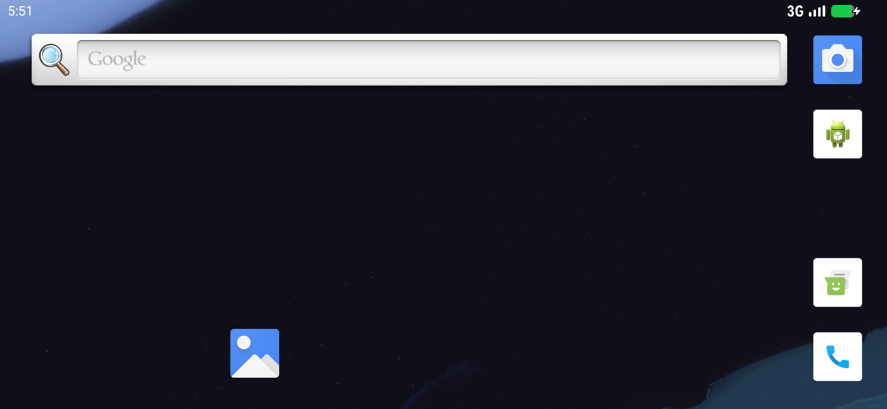

# Cuttlefish Android Emulators on NVIDIA GPU


Run multiple GPU-accelerated [Cuttlefish](https://source.android.com/docs/devices/cuttlefish)
Android virtual devices in Docker on ARM64 and x86_64 hosts with NVIDIA GPUs.
Hardware-accelerated graphics via `gfxstream` + Vulkan.

Android 16 booted with GPU rendering (x86_64 host, RTX 5080; in-guest renderer:
`ANGLE (NVIDIA, Vulkan 1.3.0 (NVIDIA Virtio-GPU GFXStream))`):



## Features

- **GPU acceleration** — `gfxstream` with the NVIDIA Vulkan backend.
- **Multi-instance** — launch many devices at once, each with pinned CPU cores
  and round-robin GPU assignment for balanced load.
- **Docker-based** — a single runtime image; the Android base is fetched once and
  shared read-only across all containers.
- **WebRTC streaming** — view any device in the browser over an SSH tunnel.
- **Low-latency ADB** — a `TCP_NODELAY` `LD_PRELOAD` shim cuts ADB round-trips
  from ~50 ms to a few ms.
- **Appium-ready (optional)** — the base images ship no Appium; an overlay image
  in [appium/](appium/) adds the server + UIAutomator2 driver when you need it.
- **Automation-ready** — devices boot with lock screen disabled, animations off,
  ANR/crash dialogs hidden, and the soft keyboard enabled.

## Requirements

- ARM64 (`aarch64`) or x86_64 host with an NVIDIA GPU.
- Ubuntu 24.04
- KVM enabled (`/dev/kvm`)
- Docker
- NVIDIA drivers

## Choosing a launcher

Both architectures live side by side, and each has a GPU launcher
(`gfxstream` + NVIDIA Vulkan) and a no-GPU launcher (SwiftShader, CPU
rendering — works on hosts without any GPU). Pick by host architecture and
whether an NVIDIA GPU is available:

| Host | Image (Dockerfile) | With GPU (gfxstream) | Without GPU (SwiftShader) |
|------|--------------------|----------------------|---------------------------|
| ARM64 | `cuttlefish-ubuntu24:latest` (`Dockerfile.arm64`) | `scripts/run-cuttlefish-gpu-arm64.sh` | `scripts/run-cuttlefish-nogpu-arm64.sh` |
| x86_64 | `cuttlefish-x86:latest` (`Dockerfile.x86`) | `scripts/run-cuttlefish-gpu-x86.sh` | `scripts/run-cuttlefish-nogpu-x86.sh` |

All four take the same arguments (`N` for a single instance, `all [count]`
for many) and use the same ports (adb `6519+N`, webrtc `8442+N`). The no-GPU
launchers are much slower and default to a reduced 1280x720 resolution — see
[Run without a GPU](#run-without-a-gpu).

## Quick start

### ARM64 (AWS g5g.metal and similar)

```bash
# 1. Clone onto the host
git clone https://github.com/x-kpanik/cuttledroid.git
cd cuttledroid

# 2. One-time host setup: NVIDIA drivers, Cuttlefish packages,
#    Android image (cvd fetch), and the Docker image
sudo ./scripts/setup-host.sh

# 3. Reboot (required for the NVIDIA driver / DRM modeset)
sudo reboot

# 4. Launch emulators
./scripts/run-cuttlefish-gpu-arm64.sh 1        # a single instance
./scripts/run-cuttlefish-gpu-arm64.sh all 14   # 14 instances
```

### x86_64 (desktop/laptop with an NVIDIA GPU)

No host provisioning and no sudo needed — the container is fully self-contained
(Cuttlefish networking runs inside the container's own network namespace). The
host only needs Docker, `/dev/kvm` and the NVIDIA driver:

```bash
git clone https://github.com/x-kpanik/cuttledroid.git
cd cuttledroid

# 1. Build the x86_64 runtime image
docker build -f Dockerfile.x86 -t cuttlefish-x86:latest .

# 2. Fetch the Android image once (~3 GB into ~/cuttlefish-base-x86)
mkdir -p ~/cuttlefish-base-x86
docker run --rm -u 1000:1000 -e HOME=/home/ubuntu \
  -v ~/cuttlefish-base-x86:/base -w /base cuttlefish-x86:latest \
  cvd fetch --default_build=aosp-android-latest-release/aosp_cf_x86_64_only_phone-userdebug

# 3. Launch
./scripts/run-cuttlefish-gpu-x86.sh 1        # adb 6520, webrtc 8443
```

### A note on fetch "404" reports

All fetch commands above use the branch form
(`aosp-android-latest-release/<target>`), which always resolves to the latest
green build and cannot rot. Three things *do* return 404 and are easily
mistaken for a missing build:

- The `aosp-main` branch — it no longer publishes public Cuttlefish artifacts.
- Old pinned build ids — Google CI garbage-collects them over time (the
  previously pinned `14654133` still downloads fine as of 2026-07, but prefer
  the branch form).
- `HEAD` requests to `ci.android.com/.../raw/...` — the service only routes
  `GET`, so `curl -I` always shows 404. Use `curl -L` instead.

Browse the available builds (build ids, targets, artifacts) in Google's CI at
[ci.android.com — aosp-android-latest-release grid](https://ci.android.com/builds/branches/aosp-android-latest-release/grid).

See "cvd fetch fails with 404" in [docs/SETUP.md](docs/SETUP.md) for details.

## Repository layout

```
.
├── Dockerfile.arm64        # ARM64 + NVIDIA runtime image (Ubuntu 24.04)
├── Dockerfile.x86          # x86_64 + NVIDIA runtime image (Ubuntu 24.04)
├── appium/                 # optional Appium overlay image (server + UIAutomator2)
├── scripts/
│   ├── setup-host.sh                 # one-time host provisioning (ARM64)
│   ├── run-cuttlefish-gpu-arm64.sh   # launch one or many GPU emulators (ARM64)
│   ├── run-cuttlefish-gpu-x86.sh     # launch GPU emulators on x86_64 hosts
│   ├── run-cuttlefish-nogpu-arm64.sh # SwiftShader (no GPU) launcher, ARM64
│   ├── run-cuttlefish-nogpu-x86.sh   # SwiftShader (no GPU) launcher, x86_64
│   └── install-and-launch.sh         # install an APK and start it on all devices
├── src/
│   └── tcp_nodelay.c       # LD_PRELOAD shim: TCP_NODELAY for low-latency ADB
└── docs/
    └── SETUP.md            # detailed setup guide and troubleshooting
```

## Usage

### Launch

```bash
./scripts/run-cuttlefish-gpu-arm64.sh 1        # instance 1 → adb 6520, webrtc 8443
./scripts/run-cuttlefish-gpu-arm64.sh 5        # instance 5 → adb 6524, webrtc 8447
./scripts/run-cuttlefish-gpu-arm64.sh all 8    # launch 8 instances
```

### Connect

```bash
adb connect localhost:6520
adb devices
```

WebRTC (over an SSH tunnel from your machine):

```bash
ssh -L 8443:localhost:8443 ubuntu@<HOST_IP>
# then open https://localhost:8443 in a browser
```

The operator root page lists all devices; a direct link to one device is
`https://localhost:8443/devices/cvd-1/files/client.html` (the old
`client.html?deviceId=...` URL is gone from cuttlefish-operator 1.5x).

### Install and launch an app on every running device

```bash
./scripts/install-and-launch.sh ~/app.apk com.example.app com.example.app.MainActivity
```

### Appium (optional)

The base images contain no Appium. Build the overlay from [appium/](appium/)
on top of either base image and pass it to any launcher via `IMAGE_NAME`:

```bash
docker build -t cuttlefish-appium:latest appium/                  # ARM64 base
docker build --build-arg BASE_IMAGE=cuttlefish-x86:latest \
  -t cuttlefish-appium-x86:latest appium/                         # x86_64 base

IMAGE_NAME=cuttlefish-appium:latest ./scripts/run-cuttlefish-gpu-arm64.sh 1
```

See [appium/README.md](appium/README.md) for starting the server inside a
running container.

### Run without a GPU

Dedicated SwiftShader (CPU rendering) launchers pass nothing GPU-related into
the container, so they work on hosts without any GPU at all:

```bash
./scripts/run-cuttlefish-nogpu-arm64.sh 1   # ARM64
./scripts/run-cuttlefish-nogpu-x86.sh 1     # x86_64
```

Much slower than gfxstream, so the default resolution is reduced (1280x720).
GPU and no-GPU instances share the same port formula — don't reuse an instance
number that a GPU instance is already using.

On an NVIDIA host you can also keep using the GPU launchers with
`GPU_MODE=guest_swiftshader` (x86_64 launcher only; the ARM64 GPU launcher
always passes the NVIDIA devices through).

## Ports

Each instance `N` uses a fixed port offset:

| Service | Formula  | Instance 1 | Instance 14 |
|---------|----------|------------|-------------|
| ADB     | 6519 + N | 6520       | 6533        |
| WebRTC  | 8442 + N | 8443       | 8456        |
| Appium* | 4722 + N | 4723       | 4736        |

\* Appium is only present in the optional [appium/](appium/) overlay image.

## Configuration

The launcher reads these environment variables (defaults shown):

| Variable          | Default                 | Description                                   |
|-------------------|-------------------------|-----------------------------------------------|
| `CUTTLEFISH_BASE` | `/opt/cuttlefish-base`  | Path to the pre-fetched Android base          |
| `GPU_MODE`        | `gfxstream_guest_angle` | `gfxstream_guest_angle` or `guest_swiftshader` (software) |
| `X_RES`, `Y_RES`  | `2340`, `1080`          | Screen resolution (landscape)                 |
| `DPI`             | `400`                   | Screen density                                |
| `CPUS`            | `6`                     | vCPUs per emulator                            |
| `MEMORY_MB`       | `10240`                 | RAM per emulator (MB)                         |

## Verify the GPU

```bash
# Inside the container
docker exec cuttlefish-emu-1 vulkaninfo --summary | head -20

# On the Android device
adb -s localhost:6520 shell dumpsys SurfaceFlinger | grep GLES
# GLES: Google (NVIDIA Corporation), Android Emulator OpenGL ES Translator (NVIDIA T4G/PCIe)
```

## Manage instances

```bash
docker logs -f cuttlefish-emu-1       # follow logs
docker exec -it cuttlefish-emu-1 bash # shell into the container
docker stop cuttlefish-emu-1          # stop
docker rm -f cuttlefish-emu-1         # remove
```

## How it works

Cuttlefish's ARM64 host tools are musl-based, while the NVIDIA Vulkan/EGL drivers
are glibc-based. The launcher bridges the two with symlinks under
`$FETCH/hostlibs/` and a minimal `LD_LIBRARY_PATH`, mounts the host's GPU
libraries read-only into each container, and passes the GPU and render nodes
through with `gfxstream` + `vhost-user`. The Android base image is fetched once
and shared read-only; per-instance runtime data lives in a bind mount.

See [docs/SETUP.md](docs/SETUP.md) for the full setup guide and troubleshooting.

## References

- [Cuttlefish documentation (AOSP)](https://source.android.com/docs/devices/cuttlefish)
- [android-cuttlefish — source and releases](https://github.com/google/android-cuttlefish)
- [ci.android.com — Cuttlefish builds (aosp-android-latest-release)](https://ci.android.com/builds/branches/aosp-android-latest-release/grid)

## Roadmap

- [x] **x86_64 host support** — `Dockerfile.x86` + `scripts/run-cuttlefish-gpu-x86.sh`.
  Fully self-contained container (in-container networking, no host services, no
  sudo). Verified on RTX 5080 / driver 595: guest renders through
  `ANGLE (NVIDIA, Vulkan)` via gfxstream. Not yet ported to x86: the
  `TCP_NODELAY` shim (Appium is available for both arches via the
  [appium/](appium/) overlay).

## License

[MIT](LICENSE)
